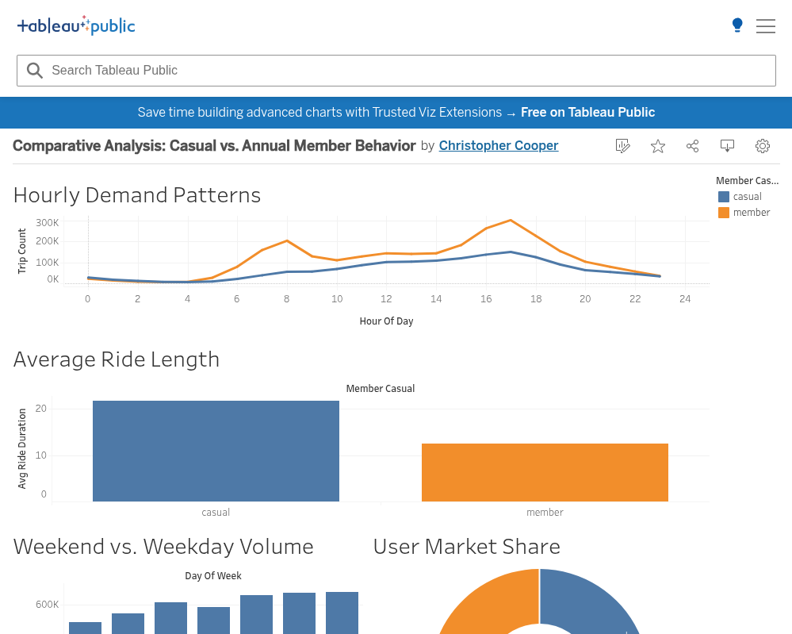

# Cyclistic Bike-Share: A SQL & Tableau Case Study
**Portfolio Project: Google Data Analytics Professional Certificate**

---

### **Executive Summary**
In this project, I acted as a junior data analyst on the marketing team for Cyclistic, a bike-share company in Chicago. By analyzing **5.6 million rows** of historical trip data, I identified key behavioral differences between casual riders and annual members. My final report provides data-driven strategies to increase annual memberships and drive company growth.

**Tools Used:** * **BigQuery (SQL):** Data Cleaning & Analysis
* **Tableau:** Data Visualization & Storytelling
* **Google Cloud Storage:** Large-scale Data Management


Google Data Analytics Capstone Project
1. Ask (The Mission)
The goal of this project was to analyze how annual members and casual riders use Cyclistic bikes differently. By identifying these patterns, I aimed to provide data-backed recommendations to the marketing team for a new strategy: converting casual riders into more profitable annual members.

2. Prepare (The Logistics)
I utilized 12 months of historical trip data from 2025. The raw data consisted of approximately 5.6 million records. Due to the volume, I bypassed Excel and used Google BigQuery and Cloud Storage to manage the data processing.

3. Process (The Audit)
In this phase, I performed a deep audit to ensure "Audit Readiness" and data integrity. I removed duplicates, filtered out "ghost trips" (rides under 1 minute), and standardized naming conventions.

The Master Clean Query:

```sql
CREATE OR REPLACE TABLE `coursera-sql-474322.cycistic_data.cleaned_trips_final` AS
SELECT DISTINCT
    ride_id, rideable_type, started_at, ended_at, member_casual,
    ROUND(CAST(TIMESTAMP_DIFF(ended_at, started_at, SECOND) / 60 AS BIGNUMERIC), 2) AS ride_length_mins,
    EXTRACT(DAYOFWEEK FROM started_at) AS day_of_week
FROM `coursera-sql-474322.cycistic_data.combined_2025_trips`
WHERE TIMESTAMP_DIFF(ended_at, started_at, MINUTE) > 1 
  AND TIMESTAMP_DIFF(ended_at, started_at, MINUTE) < 1440
  AND start_station_name IS NOT NULL;
```
Successfully refined the dataset from 5.6M rows to 4.2M high-quality records.
 
4. Analyze (The Insights)
I ran four key queries to isolate the behavioral differences between our two user groups.

A. User Type Breakdown
This shows the "Market Share" of each group.
```sql
SELECT member_casual, COUNT(*) AS total_rides,
ROUND(COUNT(*) * 100 / SUM(COUNT(*)) OVER(), 2) AS percentage
FROM `coursera-sql-474322.cycistic_data.cleaned_trips_final`
GROUP BY member_casual;
```


B. Average Trip Duration
Proves that Casuals ride for leisure (longer trips) while Members ride for utility (shorter trips).
```sql
SELECT member_casual, ROUND(AVG(ride_length_mins), 2) AS avg_duration
FROM `coursera-sql-474322.cycistic_data.cleaned_trips_final`
GROUP BY member_casual;
```


C. Peak Hour Trends
Identifies rush-hour commuting spikes vs. weekend leisure spikes. 
```sql
SELECT member_casual, EXTRACT(HOUR FROM started_at) AS hour_of_day, COUNT(*) AS trip_count
FROM `coursera-sql-474322.cycistic_data.cleaned_trips_final`
GROUP BY member_casual, hour_of_day
ORDER BY hour_of_day;
```


D. Bike Preference
Shows asset utilization across both categories.
```sql
SELECT member_casual, rideable_type, COUNT(*) AS total_trips
FROM `coursera-sql-474322.cycistic_data.cleaned_trips_final`
GROUP BY member_casual, rideable_type
ORDER BY total_trips DESC;
```

5. Share (Visualizing the Data)
   
   Data is only as good as the story it tells. After auditing the dataset in BigQuery, I exported the key metrics to Tableau to create an interactive executive dashboard. This allows stakeholders to drill down into ridership patterns by user type and time of day.


7. Act (Recommendations)
Based on the data, here are my top three recommendations for the marketing team:

The "Weekend Pass" Tier: Since Casual usage peaks on weekends, launch a weekend-only membership to bridge the gap to full annual status.

Electric Bike "Member-Only" Surcharges: Offer lower minute rates for electric bikes to Annual Members to incentivize Casuals (who prefer electrics) to switch.

Spring/Summer Digital Campaign: Focus heavy ad spend in early April on social media platforms, targeting leisure riders at the start of the peak season.
